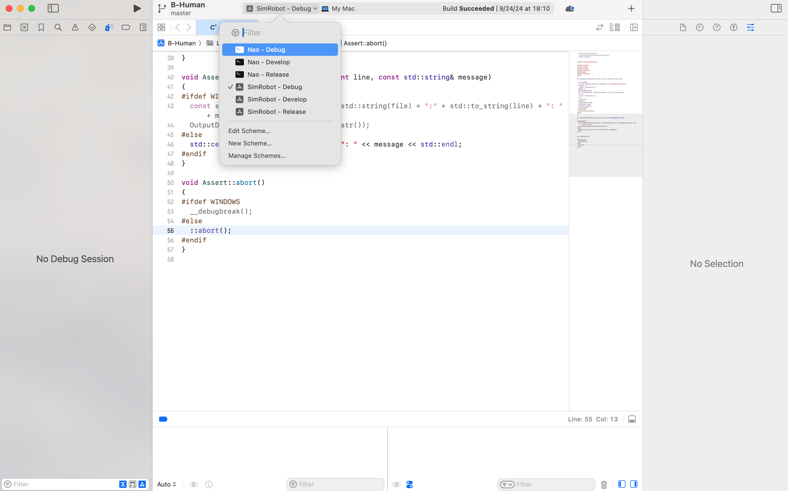

# BadgerRLSystem

💡 This page will go through the environment setup for `BadgerRLSystem` for Mac, Linux, and Windows, and how to deploy the project on SimRobot and NAO Robot.

# Installation

- BadgerRLSystem is the BadgerRL internal fork of [BHumanCodeRelease](https://github.com/bhuman/BHumanCodeRelease), which replaced some parts to be compatible with RL policy.
- The environment setup follows the [B-Human Documentation](https://docs.b-human.de/master/getting-started/initial-setup/), with minor revision
- Version not matter too much as long as you can successfully running your project on SimRobot.

## MacOS

### Required Dependency

- macOS 14.6+ (Intel or ARM)
- Xcode 16.0
  - Xcode must be executed at least once to accept its license and to install its components.
- CMake 3.26.3
  - Use a "macOS 10.13 or later" `.dmg` from [here](https://cmake.org/download/) or install a `cmake` that can be found in the `$PATH` (e. g. via Homebrew).
  - If you want to install a more specific version or check all availableversions, please go [here](https://github.com/Kitware/CMake/releases).

### Setting up the Working Copy

- Cloning the Repository
  - As the BadgerRLSystem repository uses submodules, it must be cloned using `git clone --recursive`. Downloading it as `zip` or `tar.gz` does not work.
  - On macOS, the working copy must be either located outside of folders protected by macOS (e.g. `Desktop`, `Documents`, `Downloads`, etc.), or you have to grant full disk access to `/bin/bash`.
  - All paths mentioned in this documentation will be relative to the main directory of the working copy.

### Running project on SimRobot or Nao Physical Robots

💡 See B-Human [SimRobot](https://docs.b-human.de/master/simrobot/#simrobot) and [Nao Robot](../NAO%20Robots/NAO%20Robots.html) for more information

1. Creating Project Files / Compiling the Code
   - Run `Make/macOS/generate` and open the Xcode project `Make/macOS/B-Human.xcodeproj`. The schemes in the toolbar allow building the targets mentioned in [this section](https://docs.b-human.de/master/getting-started/initial-setup/#targets-and-configurations) in different configurations.
   - On ARM machines, there is also the option to run `Make/macOS/generate -r` to generate an Xcode project that will still compile Intel code, which runs via Rosetta 2.
2. Open Xcode project from `Make/macOS/B-Human.xcodeproj`
3. Select the environment you want to deploy your project
   - `Nao` mode will deploy the code in physical robot, you need to turn on a robot and connect to Lab (1351 CS building) LAN `SPL_WISC`
   - `SimRobot` will open up simulation environment. See [here](https://docs.b-human.de/master/getting-started/initial-setup/#targets-and-configurations) to learn about `Debug/Develop/Release`
     
4. Click the start button to launch an instance, you will need to wait for building complete
   - **SimRobot**:
     Refer [here](https://docs.b-human.de/master/simrobot/#simrobot) and [SimRobot Code Overview](../SimRobot/SimRobot.html) to learn more about SimRobot
     - You need to select a scene file `.ros2` to open a pre-defined robot soccer. A good first scene to try is `OneTeamFast.ros2`. Feel free to refer to any `.ros2` and `.con` under `Config/Scenes/` or [here](https://docs.b-human.de/master/simrobot/#scene-description-files) if you want to build your own scene.
       
     - After open a scene, double click `Console` to open a console where you can write command, double click `RoboCup` to display the rendered environment.
       - Refer [here](https://docs.b-human.de/master/simrobot/#console-commands) to learn more about console command
         
     - To start the simulation, enter the following commands in the console:
       1. To instruct the robots to prepare for a kickoff, type `gc ready` . The robots should walk to their kickoff positions.
       2. Once the robots have reached their kickoff positions, type `gc set` to tell the robots to stop moving and get ready for kickoff.
       3. Type `gc playing` to start a countdown after which the game will begin.
       - Entering the commands in the order above is the official way to start the game. If you don’t care about this, just type `gc playing`.
   - **Nao Deployment: (This section will go through initial deployment, for how to handle NAO robots and further instruction, refer “How to deploy” under** [NAO Robots](../NAO%20Robots/NAO%20Robots.html)**)**
     - You need to go to the Lab (1351 CS building) where Nao Robots located, turn on robot(s), connect to the Lab LAN `SPL_WISC`.
     - If an robot is turn on, and your computer connect `SPL_WISC`, the line relate with the robot will have active data (the image below showing no active robots, either because not turning on robot or connect to `SPL_WISC`).
     - You can config setting for deployment in the right sidebar. Please Note:
       - **❗️REMEMBER** to select `SPL_WISC` in Wireless profile before click `Deploy`. Otherwise, you will need to physically connect to the robot with a cable to redeploy. See “NAO Connection and File System” section under [NAO Robots](../NAO%20Robots/NAO%20Robots.html) for instruction with cable connection.
       - **❗️**In Xcode, when clicking deploy, all active robot will be deployed with the same file. If you want to deploy different files to different robot, either turn off one and deploy another, or use a linux machine to deploy with command line.
         

## Linux

💡 It is highly recommend to use the Lab Linux machine since it is already have environment setup, see [here](../Lab%20Server/Lab%20Server.html) for instruction of Lab Machine

### Required Dependency

- A 64-bit Linux, e.g. Ubuntu 22.04 LTS
- The following packages (here for Ubuntu 22.04 LTS):
  `sudo apt install ccache clang cmake exfatprogs git graphviz libasound2-dev libbox2d-dev libgl-dev libqt6opengl6-dev libqt6svg6-dev libstdc++-12-dev llvm mold net-tools ninja-build pigz qt6-base-dev rsync xxd`

### Setting up the Working Copy

- Cloning the Repository
  - As the BadgerRLSystem repository uses submodules, it must be cloned using `git clone --recursive`. Downloading it as `zip` or `tar.gz` does not work.
  - All paths mentioned in this documentation will be relative to the main directory of the working copy.

### Running project on SimRobot or Nao Physical Robots

💡 Check [SimRobot](https://docs.b-human.de/master/simrobot/#simrobot) and [Nao Robots](../NAO%20Robots/NAO%20Robots.html) for more information

1. Compile and deploy on SimRobot
   1. Run `Make/Linux/generate` to generate CMake caches.
   2. Run `Make/Linux/compile [<configuration>] [<target>]` to compile the code (using a configuration and target from [this section](https://docs.b-human.de/master/getting-started/initial-setup/#targets-and-configurations), *Develop* is the default configuration).
   3. run `./Build/Linux/SimRobot/[<configuration>]/SimRobot` from the top-level directory to open SimRobot, check [here](https://docs.b-human.de/master/simrobot/#simrobot) or see **Running project on SimRobot or Nao Physical Robots** section under MacOS setup to learn how to interact with SimRobot
2. Compile and deploy on Nao Robots **(This section will go through initial deployment, for further instruction, refer “How to deploy” under** [NAO Robots](../NAO%20Robots/NAO%20Robots.html)**)**

   - you need to turn on your choice of robots and connect to Lab (1351 CS building) LAN `SPL_WISC`
   - **REMEMBER** to select `SPL_WISC` when deploying in Lab (1351 CS building). Otherwise, you will need to physically connect to the robot with a cable to redeploy.

   1. Run `Make/Linux/generate` to generate CMake caches.
   2. refer to [Deploying the Software](https://docs.b-human.de/master/getting-started/running-the-code/#deploying-the-software) for deploy command

      - For example, `Make/Common/deploy Release -r 3 10.0.54.3 -t 8 -w SPL_WISC -b -v 40`

        1. `Make/Common/deploy` will compile the code
        2. `Release` is the `[<configuration>]` same as in SimRobot
        3. `-r 3 10.0.54.3`

           copy to ip `10.0.54.3` and set player number to `3` (one -r per robot), the 3 in ip specify robot3, the `-r 3` is what we specify in our code. For example, you can call `-r 5 10.0.54.3` to deploy the code of robot5 on physical robot 3

        4. `-t 8` specify team 8
        5. `-w SPL_WISC` specify using `SPL_WISC` as wireless profile
        6. `-b` restart bhuman
        7. `-v 40` set NAO's volume as 40%

## Windows

💡 Please refer to [B-Human documentation](https://docs.b-human.de/master/getting-started/initial-setup/) about initial setup on Windows

**TODO**
