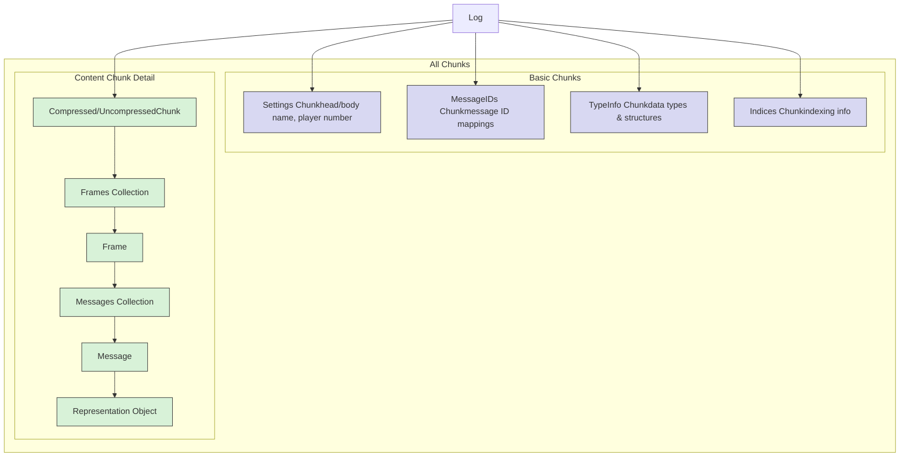

```mermaid
graph TD
    Log --> SC[SettingsChunk]
    Log --> MC[MessageIDsChunk]
    Log --> TIC[TypeInfoChunk]
    Log --> UC[Compressed/UncompressedChunk]
    Log --> IC[IndicesChunk]
    
    subgraph Chunks[All Chunks]
        subgraph Basic Chunks
            SC[Settings Chunkhead/body name, player number]
            MC[MessageIDs Chunkmessage ID mappings]
            TIC[TypeInfo Chunkdata types & structures]
            IC[Indices Chunkindexing info]
        end

        subgraph Content Chunk Detail
            UC --> Frames[Frames Collection]
            Frames --> Frame[Frame]
            Frame --> Messages[Messages Collection]
            Messages --> Message[Message]
            Message --> RO[Representation Object]
        end
    end

    %% Styles
    classDef chunkStyle fill:#f2d8d8,stroke:#333
    classDef contentStyle fill:#d8f2d8,stroke:#333
    classDef basicChunkStyle fill:#d8d8f2,stroke:#333
    
    class UC,Frames,Frame,Messages,Message,RO contentStyle
    class SC,MC,TIC,IC basicChunkStyle
```