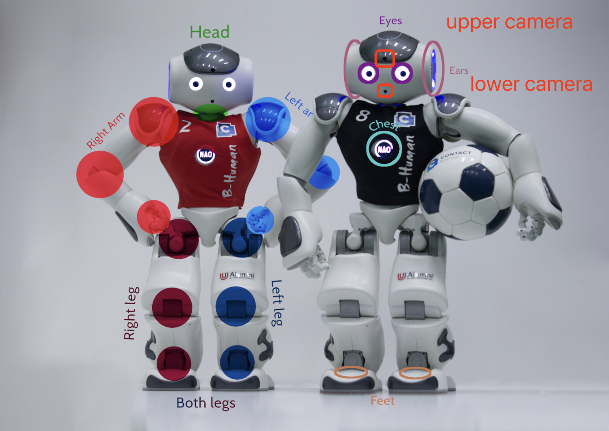
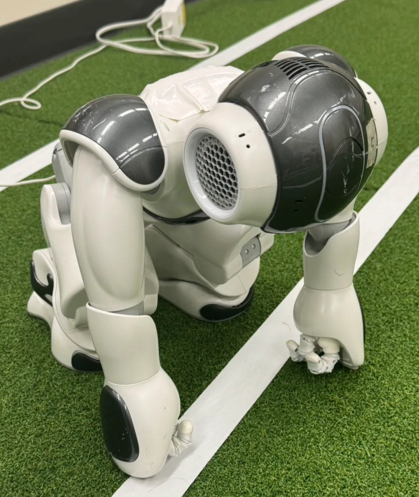
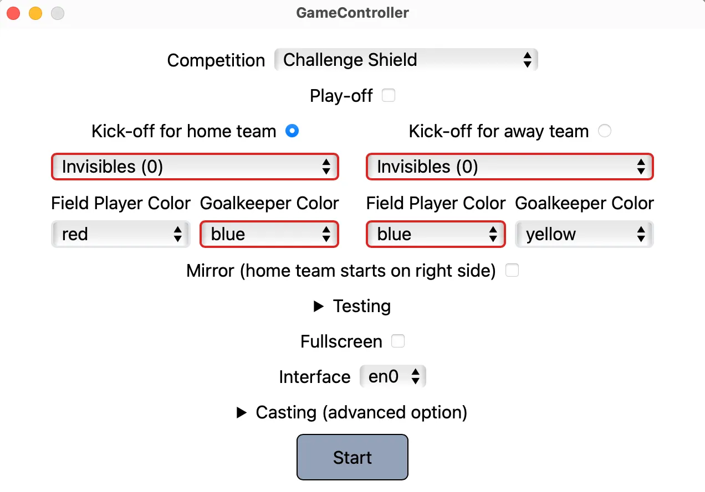

  

    Table of contents
  

  {: .text-delta }
1. TOC
{:toc}

# NAO Robots

- Basic Concepts: Handling the NAO[¶](https://docs.b-human.de/master/handling-the-nao/#handling-the-nao)
- This page will help you go through:
    1. Physical structure and key buttons on NAO Robot
    2. Deployment and GameController Usage
    3. Connecting NAO Robot and inside file structure
    
    Please carefully go through NAO Robot Overview → Handling Robot → Caution, misuse will lead to injury and property damage.
    

# NAO Robot Overview

{:.hint}
The overview follows the [Handling the NAO](https://docs.b-human.de/master/handling-the-nao/), with minor revision.

## Physically Structure

The robot's structure is shown below. Note that the camera is not in the eyes but in the red boxes circled.

{: .responsive-graph-medium}

## Handling Robot

### Turning On

- Before turn on the robot, make sure its position is unstiff, which is like sitting, see image below. Don’t change its position before turning on.
    
    {: .responsive-graph-small}
    
- The robot can be turned on with a short press on the chest button. You will see white light flashing on his chest button for ~20 seconds.
    - It is very important not to move the robot while it is booting up, because its software is calibrating the inertia measurement unit (IMU) during this time. Motion will result in wrong calibration offsets.
- After booting up, the robot’s eye will flash white for a sec, and it will say “Grounds”, its chest button and head turns to flash blue light. At this stage, the robot is still in sitting position.
    - You still shouldn’t move it at this point. If offsets are detected, a siren sound will be played. In such a case the robot needs to be turn off and rebooted again.
    - At this point, you can see its status in Deploydialog as active, meaning you can deploy your file in the robot(s).
        
        {: .responsive-graph-medium}
        
- Now you can short press the chest button again, chest button turning green meaning you are pressing it correctly. The robot will stand up stiff after you press it, and you’ll see its foot light also turns green.
    - At this point, you can move the robot. When lift it up, it will say “High”, meaning it detect itself left the ground.

### Turning Off

- The robot can be turned off with long press on the chest button, you will see the chest button light turning green, after pressing it for ~5 seconds, the robot will unstiff (sit), and the chest button light turns red then lights out, meaning it is shut down.

### General Use

When turned on, the robot can switch between different states as shown in the following image (Source: RoboCup SPL Rules 2023):

{: .responsive-graph-medium}

- From every state you can switch into the `Unstiff` state by touching all three head buttons for at least one second (blue arrow).
- You can switch from `Unstiff` to `Initial` to `Penalize` to `Playing` and back to `Penalize` with a press of the chest button (gray arrows).
- `Standby`, `Ready`, and `Set` can only be reached in some demos or via the GameController.
- `Calibration` is described in the [calibration chapter](https://docs.b-human.de/master/calibration/) (purple arrow).

### ❗️Caution (for safety purpose and avoiding property damage)

- [Possible Problems](https://docs.b-human.de/master/handling-the-nao/#possible-problems)
- Don’t press any button when robot is moving.
- You should make sure the robot is unstiff (sit) before turning it on.
- Be careful when moving robot, they may suddenly move and hurt you.
- Put the robot in a soft ground, e.g. soccer field. Don’t put it on high place or uneven/hard ground, and keep them far from stiff things.
- When not using robot (Inactive), get it charged and stored in one of the following two position:
    
    {:.hint}
    Note the second position should be stored in a way that the robot is unstiffed via the head buttons or turning off.
    
    
    {: .responsive-graph-small}
    
    {: .responsive-graph-small}
    

# Deployment

{:.hint}
Please first go through Running project on Nao Physical Robots part 4 under [Environment Setup (Mac, Linux, Windows)](https://www.notion.so/Environment-Setup-Mac-Linux-Windows-10da6491b30a80a884a7db93abfb479b?pvs=21) to learn initial deployment

1. Turn on the robot(s)
2. Deploy
    - check deployment instructions in [Environment Setup (Mac, Linux, Windows)](https://www.notion.so/Environment-Setup-Mac-Linux-Windows-10da6491b30a80a884a7db93abfb479b?pvs=21)
    - In MacOS Xcode, you will see that the active robot has active data in Deploydialog (the image below shows only robot5 is active), but you can only deploy robots simultaneously. One solution is to turn on one for deployment while turning off others.
        
        {: .responsive-graph-medium}
        
    - In Linux, you can use command line to deploy robot separately or simultaneously.
3. When start deploy, you will see the robot(s) unstiff, stop flashing chest button light.
4. After deploy successfully, the robot(s) will flash its chest button light in blue, and say “Grounds”.
5. Now you can use GameController to start playing with them.

# GameController

## Download

- Download the GameController app from its original repo https://github.com/RoboCup-SPL/GameController3: Click Releases in the right sidebar, select a specific version (usually the most recent version), and download an asset for your computer.
    - Mac might block you from opening it. You need to navigate to your system setting → privacy & security → Security → open it anyway
    - You need to connect to the same network to control the robot (SPL_WISC in CS Building Lab 1351)

## How to Use

- First, you will see this page below when opening up GameController. Generally, you only need to select the competition type and teams (note you assign the robot a team during deployment). Then click “Start”.
    
    {: .responsive-graph-medium}
    
- After start the game, you will see another page as shown below.
    - The red dot means this robot is inactive (either not turn on or assign to that team).
    - Green dot means this robot is active (in the image below, robot5 is turned on and assigned in WisTex United during deployment).
    
    
    ❗ Note only if the robot is stand (press chest button when unstiff), it will react to GameController Ready, Set, Playing etc. signals
    
    
    
    {: .responsive-graph-medium}
    
- You can click “Ready” at the up-middle bar, then you will see “Set” and “Playing” in the same bar, you can also click “Ready” at the bottom bar. They will perform the same as in SimRobot using `gc [ready/set/playing]`.
    
    {: .responsive-graph-medium}
    
- Click “Finish” to stop a round.

# NAO Connection and File System

## Connect to NAO Robot

### Wireless connection

- use `ssh nao@10.0.[<team number>].[<robot number>]` when you are connecting to the same network as robot, `SPL_WISC` in CS building 1351.
    - for example, `ssh nao@10.0.54.5` connect to robot5 of team54.

### Ethernet Cable connection

🔑

When you accidentally deploy with different Wireless profile, e.g. select `SPL_D` in Wireless profile but you and robot are under `SPL_WISC`, then you can neither control robot through GameController nor redeploy it through `SPL_WISC` to refresh it. In this case, you will need to use a ethernet cable to connect it to redeploy.

- Configure your network (works for mac, not sure if workable for Linux and Windows)
    1. add a service to your networking settings
        
        {: .responsive-graph-small}
        
    2. Config the new server same as shown below
        
        {: .responsive-graph-medium}
        
    3. It should display connected (green dot) when you are connecting robot with a ethernet cable.
- use `ssh nao@192.168.[<team number>].[<robot number>]` when you are connecting the robot through a ethernet cable.
    - for example, `ssh nao@192.168.54.5` connect to robot5 of team54.

## A Brief Look at NAO File Structure

- After connecting to NAO Robot, you will see these directories and files with `ls`
    
    `Config  Profiles  bin  logging  logs  robocup.conf`
    
    - `Config`: the configuration of this robot, feel free to check each file with its connection to the deployment dialog and your deployment file.
        - if you changed anything, you can redeploy to refresh it
        - if you want to confirm the team number, goto settings.cfg
    - `Profiles`: network configuration
    - `logging` & `logs`: store log files; you can delete log files if they are confusing.