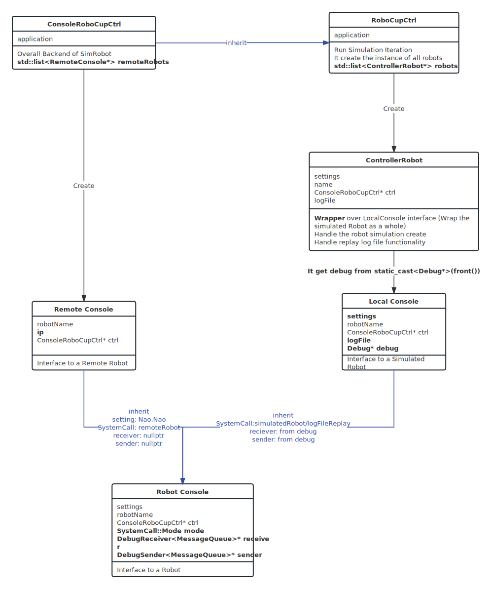

# SimRobot

ℹ️ This section will trace the control flow of BHuman Robot.

Generally, SimRobot is just a simulated environment that allows BHuman robots to play in a virtual environment. The structure is relatively simple

